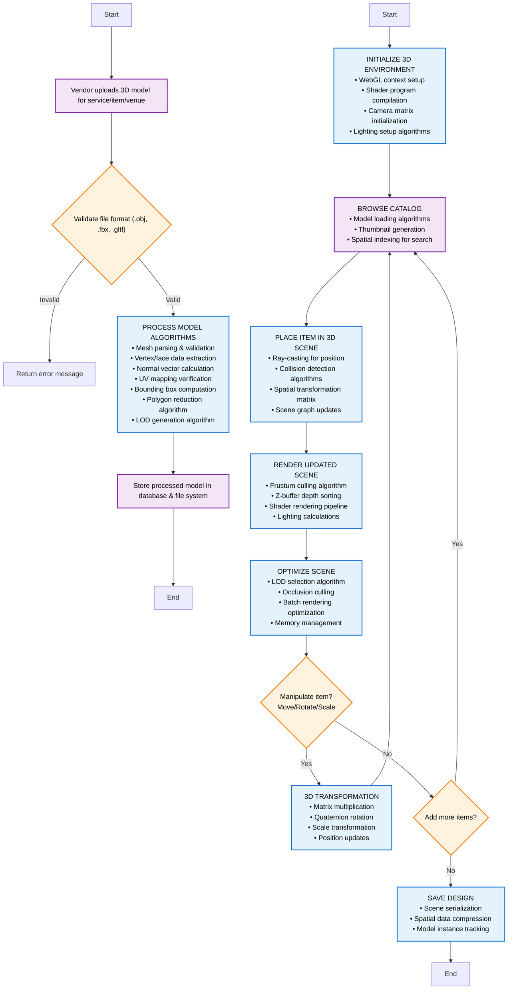

# Algorithm Design: 3D Venue Modeling System

## System Overview
The 3D venue modeling system is the core technology of the Wedding planning platform, utilizing advanced computer graphics algorithms to enable real-time 3D scene manipulation and visualization. This document focuses on the algorithmic foundations of the 3D modeling pipeline, from mesh processing to real-time rendering.

## Core 3D Technology Components

### Phase 1: 3D Model Processing Pipeline
**Algorithms**: Mesh parsing, geometry validation, polygon reduction, LOD generation
**Objective**: Transform vendor-uploaded 3D models into optimized, web-ready assets

### Phase 2: WebGL Rendering Environment  
**Algorithms**: WebGL context initialization, shader compilation, camera/projection matrices
**Objective**: Establish real-time 3D rendering environment with proper graphics pipeline

### Phase 3: Interactive 3D Scene Manipulation
**Algorithms**: Ray-casting, collision detection, spatial transformations, scene graph management
**Objective**: Enable real-time object placement and manipulation in 3D space

### Phase 4: Real-time Rendering Optimization
**Algorithms**: Frustum culling, LOD selection, batch rendering, lighting calculations
**Objective**: Maintain smooth 60fps performance during interactive 3D scene design

## Visual Algorithm Flowchart

The following Mermaid flowchart provides a visual representation of the 3D modeling workflow:



## Core 3D Modeling Algorithms

### Phase 1: 3D Model Processing Algorithms

#### A. Model Parsing and Validation
```
INPUT: 3D model file (.obj, .fbx, .gltf)
│
├─ FILE FORMAT VALIDATION
│  ├─ Parse file headers and metadata
│  ├─ Validate file integrity
│  └─ Check supported format specifications
│
├─ GEOMETRY EXTRACTION
│  ├─ Parse vertex positions: V(x, y, z)
│  ├─ Extract face indices: F(v1, v2, v3)
│  ├─ Read texture coordinates: UV(u, v)
│  └─ Load material properties
│
├─ MESH VALIDATION
│  ├─ Check vertex-face consistency
│  ├─ Validate normal vectors
│  ├─ Detect degenerate triangles
│  └─ Ensure manifold mesh topology
│
└─ BOUNDING BOX CALCULATION
   ├─ Find min/max coordinates: (xmin, ymin, zmin) to (xmax, ymax, zmax)
   ├─ Calculate center point: C = (min + max) / 2
   └─ Compute dimensions: D = max - min
```

#### B. Mesh Optimization Algorithms
```
POLYGON REDUCTION ALGORITHM (Quadric Error Metrics)
│
├─ FOR each vertex V:
│  ├─ Calculate quadric error matrix Q
│  ├─ For each adjacent edge E(V, Vi):
│  │  ├─ Compute contraction cost = VT * (Q + Qi) * V
│  │  └─ Store in priority queue
│  └─ Select minimum cost edge for collapse
│
├─ REPEAT until target polygon count reached:
│  ├─ Remove minimum cost edge
│  ├─ Merge vertices: Vnew = optimal position
│  ├─ Update adjacent faces
│  └─ Recalculate quadric matrices
│
└─ OUTPUT: Optimized mesh with reduced polygons
```

#### C. Level of Detail (LOD) Generation
```
LOD GENERATION ALGORITHM
│
├─ CREATE multiple resolution levels:
│  ├─ LOD0 (High): 100% original polygons
│  ├─ LOD1 (Medium): 50% polygon reduction
│  ├─ LOD2 (Low): 25% polygon reduction
│  └─ LOD3 (Minimal): 10% polygon reduction
│
├─ FOR each LOD level:
│  ├─ Apply polygon reduction algorithm
│  ├─ Preserve important features (edges, corners)
│  ├─ Maintain UV mapping consistency
│  └─ Generate optimized textures
│
└─ STORE all LOD versions with metadata
```

### Phase 2: 3D Environment Initialization

#### A. WebGL Context and Shader Setup
```
WEBGL INITIALIZATION
│
├─ GET WebGL context from HTML5 canvas
├─ CHECK WebGL capabilities and extensions
├─ SET viewport dimensions and aspect ratio
│
├─ COMPILE SHADERS:
│  ├─ Vertex Shader:
│  │  ├─ Transform vertices: gl_Position = MVP * vertex
│  │  ├─ Calculate lighting vectors
│  │  └─ Pass texture coordinates to fragment shader
│  │
│  └─ Fragment Shader:
│     ├─ Sample textures: color = texture2D(sampler, uv)
│     ├─ Apply lighting calculations
│     └─ Output final pixel color: gl_FragColor
│
└─ CREATE shader program and link attributes
```

#### B. Camera and Projection Matrix Setup
```
CAMERA SYSTEM INITIALIZATION
│
├─ PROJECTION MATRIX (Perspective):
│  ├─ P = perspective(fov, aspect, near, far)
│  ├─ fov = 45 degrees field of view
│  ├─ aspect = canvas.width / canvas.height
│  ├─ near = 0.1, far = 1000.0 clipping planes
│
├─ VIEW MATRIX (Camera transformation):
│  ├─ V = lookAt(eye, target, up)
│  ├─ eye = camera position in world space
│  ├─ target = point camera is looking at
│  ├─ up = camera up vector (0, 1, 0)
│
└─ MODEL-VIEW-PROJECTION:
   └─ MVP = P * V * M (for each object)
```

### Phase 3: Real-time 3D Scene Manipulation

#### A. Ray-Casting for Object Placement
```
RAY-CASTING ALGORITHM
│
INPUT: Mouse coordinates (screenX, screenY)
│
├─ SCREEN TO WORLD COORDINATE CONVERSION:
│  ├─ Normalize screen coordinates: NDC = (2*screen/canvas - 1)
│  ├─ Create ray in clip space: rayClip = (NDC.x, NDC.y, -1, 1)
│  ├─ Transform to eye space: rayEye = inverse(P) * rayClip
│  └─ Transform to world space: rayWorld = inverse(V) * rayEye
│
├─ RAY-PLANE INTERSECTION (with ground plane):
│  ├─ Plane equation: ax + by + cz + d = 0
│  ├─ Ray equation: P(t) = origin + t * direction
│  ├─ Solve for t: t = -(a*ox + b*oy + c*oz + d) / (a*dx + b*dy + c*dz)
│  └─ Intersection point: P = origin + t * direction
│
└─ OUTPUT: 3D world position for object placement
```

#### B. Collision Detection Algorithms
```
COLLISION DETECTION SYSTEM
│
├─ AXIS-ALIGNED BOUNDING BOX (AABB) TEST:
│  ├─ FOR each existing object in scene:
│  │  ├─ Get object AABB: (min1, max1)
│  │  ├─ Get new item AABB: (min2, max2)
│  │  └─ Test overlap: overlap = (min1 <= max2) && (max1 >= min2)
│  │
│  ├─ VENUE BOUNDARY CHECK:
│  │  ├─ Check if item AABB is within venue bounds
│  │  └─ Prevent placement outside venue walls
│  │
│  └─ RETURN collision status: true/false
│
├─ ORIENTED BOUNDING BOX (OBB) TEST (for rotated objects):
│  ├─ Transform AABBs to world space
│  ├─ Apply rotation matrices
│  └─ Use Separating Axis Theorem (SAT)
│
└─ MESH-LEVEL COLLISION (high precision):
   ├─ Use spatial partitioning (Octree/BSP)
   ├─ Test triangle-triangle intersections
   └─ Calculate exact contact points
```

#### C. 3D Transformation Algorithms
```
3D TRANSFORMATION MATRIX OPERATIONS
│
├─ TRANSLATION MATRIX:
│  │   [1  0  0  tx]
│  │   [0  1  0  ty]
│  T = [0  0  1  tz]
│  │   [0  0  0  1 ]
│
├─ ROTATION MATRICES:
│  ├─ X-axis: Rx(θ) = [1   0      0    ]
│  │                  [0  cos(θ) -sin(θ)]
│  │                  [0  sin(θ)  cos(θ)]
│  │
│  ├─ Y-axis: Ry(θ) = [cos(θ)  0  sin(θ)]
│  │                  [0       1  0     ]
│  │                  [-sin(θ) 0  cos(θ)]
│  │
│  └─ Z-axis: Rz(θ) = [cos(θ) -sin(θ) 0]
│                     [sin(θ)  cos(θ) 0]
│                     [0       0      1]
│
├─ SCALE MATRIX:
│  │   [sx  0   0   0]
│  │   [0   sy  0   0]
│  S = [0   0   sz  0]
│  │   [0   0   0   1]
│
└─ COMBINED TRANSFORMATION:
   └─ M = T * R * S (Translation * Rotation * Scale)
```

### Phase 4: Rendering and Optimization

#### A. Scene Graph Management
```
SCENE GRAPH ALGORITHM
│
├─ SCENE TREE STRUCTURE:
│  ├─ Root Node (Venue)
│  │  ├─ Child Node (Table Group)
│  │  │  ├─ Table Model
│  │  │  └─ Chair Models [array]
│  │  ├─ Child Node (Decoration Group)
│  │  └─ Child Node (Lighting Group)
│
├─ MATRIX PROPAGATION:
│  ├─ FOR each node in tree (depth-first):
│  │  ├─ parentMatrix = parent.worldMatrix
│  │  ├─ localMatrix = node.transformation
│  │  └─ worldMatrix = parentMatrix * localMatrix
│
└─ RENDER TRAVERSAL:
   ├─ Apply frustum culling per node
   ├─ Calculate LOD level based on distance
   └─ Submit geometry to GPU
```

#### B. Real-time Rendering Pipeline
```
RENDERING PIPELINE ALGORITHM
│
├─ FRUSTUM CULLING:
│  ├─ Extract 6 frustum planes from MVP matrix
│  ├─ FOR each object:
│  │  ├─ Test AABB against all 6 planes
│  │  ├─ IF outside any plane: CULL object
│  │  └─ ELSE: add to render queue
│
├─ Z-BUFFER DEPTH SORTING:
│  ├─ Enable depth testing: glEnable(GL_DEPTH_TEST)
│  ├─ Clear depth buffer: glClear(GL_DEPTH_BUFFER_BIT)
│  └─ GPU handles per-pixel depth comparison
│
├─ BATCH RENDERING OPTIMIZATION:
│  ├─ Group objects by material/shader
│  ├─ Sort by depth (front-to-back for opaque)
│  ├─ Minimize state changes
│  └─ Use instanced rendering for repeated objects
│
└─ LIGHTING CALCULATIONS:
   ├─ Phong Lighting Model:
   │  ├─ Ambient: Ia = ka * La
   │  ├─ Diffuse: Id = kd * Ld * max(0, N·L)
   │  └─ Specular: Is = ks * Ls * max(0, R·V)^n
   └─ Final Color = Ia + Id + Is
```

#### C. Performance Optimization Algorithms
```
LOD SELECTION ALGORITHM
│
INPUT: Camera position, Object position
│
├─ CALCULATE distance:
│  └─ d = length(cameraPos - objectPos)
│
├─ SELECT appropriate LOD:
│  ├─ IF d < 10 units: use LOD0 (highest detail)
│  ├─ ELSE IF d < 50 units: use LOD1 (medium detail)
│  ├─ ELSE IF d < 100 units: use LOD2 (low detail)
│  └─ ELSE: use LOD3 (minimal detail)
│
└─ LOAD and render selected LOD model
```

### Data Structure Specifications

#### 3D Vector Operations
```cpp
struct Vector3 {
    float x, y, z;
    
    // Vector addition: v3 = v1 + v2
    Vector3 add(Vector3 v) { return {x+v.x, y+v.y, z+v.z}; }
    
    // Dot product: dot = v1 · v2
    float dot(Vector3 v) { return x*v.x + y*v.y + z*v.z; }
    
    // Cross product: v3 = v1 × v2
    Vector3 cross(Vector3 v) { 
        return {y*v.z - z*v.y, z*v.x - x*v.z, x*v.y - y*v.x}; 
    }
    
    // Vector length: |v|
    float length() { return sqrt(x*x + y*y + z*z); }
}
```

#### 4x4 Matrix Operations
```cpp
struct Matrix4 {
    float m[16]; // Column-major order
    
    // Matrix multiplication: C = A * B
    Matrix4 multiply(Matrix4 b) {
        Matrix4 result;
        for(int i = 0; i < 4; i++) {
            for(int j = 0; j < 4; j++) {
                result.m[i*4+j] = 0;
                for(int k = 0; k < 4; k++) {
                    result.m[i*4+j] += m[i*4+k] * b.m[k*4+j];
                }
            }
        }
        return result;
    }
}
```

This algorithm design focuses specifically on the **3D modeling and rendering techniques** that power your wedding venue design system, providing the technical depth expected in an Algorithm Design document.

## 3D Algorithm Complexity Analysis

### Time Complexity
- **Model Parsing**: O(n) where n = number of vertices/faces in model
- **Polygon Reduction**: O(n log n) where n = number of edges (priority queue operations)
- **LOD Generation**: O(k × n log n) where k = number of LOD levels
- **Ray-Casting**: O(1) for single ray-plane intersection
- **AABB Collision Detection**: O(m) where m = number of objects in scene
- **Matrix Multiplication**: O(1) for 4×4 matrices (constant 64 operations)
- **Frustum Culling**: O(m) where m = number of objects to test
- **Scene Rendering**: O(p) where p = number of visible polygons

### Space Complexity
- **Model Storage**: O(v + f) where v = vertices, f = faces
- **LOD Versions**: O(k × (v + f)) where k = number of LOD levels
- **Scene Graph**: O(n) where n = number of objects in scene
- **Transformation Matrices**: O(n) where n = number of objects (16 floats each)
- **GPU Memory**: O(p) where p = total polygons loaded on GPU

### Performance Optimization Techniques

#### 1. 3D Model Processing
- **Quadric Error Metrics**: Preserves visual quality during polygon reduction
- **Progressive Meshes**: Enable smooth LOD transitions
- **Texture Atlasing**: Reduce draw calls by combining textures
- **Mesh Compression**: Reduce memory footprint and loading times

#### 2. Real-time Rendering Optimization
- **Spatial Partitioning**: Use Octree/BSP trees for efficient culling
- **Instance Rendering**: Render multiple copies of same object efficiently
- **GPU Batch Processing**: Minimize CPU-GPU communication overhead
- **Shader Optimization**: Use efficient algorithms in vertex/fragment shaders

#### 3. Memory Management
- **Object Pooling**: Reuse transformation matrices and temporary objects
- **Garbage Collection**: Minimize allocations during rendering loop
- **Streaming**: Load/unload models based on camera proximity
- **Compression**: Use compressed texture formats (DXT, ETC, ASTC)

## 3D Graphics Pipeline Integration

### WebGL Rendering Context
```javascript
// Vertex Buffer Objects (VBO) management
const vertexBuffer = gl.createBuffer();
gl.bindBuffer(gl.ARRAY_BUFFER, vertexBuffer);
gl.bufferData(gl.ARRAY_BUFFER, vertices, gl.STATIC_DRAW);

// Shader attribute binding
const positionAttribute = gl.getAttribLocation(program, 'aPosition');
gl.enableVertexAttribArray(positionAttribute);
gl.vertexAttribPointer(positionAttribute, 3, gl.FLOAT, false, 0, 0);
```

### Real-time Performance Monitoring
```javascript
// Performance metrics tracking
const performanceMetrics = {
    frameTime: 0,           // Time per frame (ms)
    triangleCount: 0,       // Visible triangles rendered
    drawCalls: 0,          // Number of GPU draw calls  
    memoryUsage: 0,        // GPU memory consumption
    lodSwitches: 0         // LOD level changes per frame
};
```

## Mathematical Foundations

### 3D Coordinate Systems
- **World Space**: Global coordinate system for the entire scene
- **View Space**: Coordinates relative to camera position
- **Clip Space**: Normalized device coordinates (-1 to 1)
- **Screen Space**: Final 2D coordinates for rendering

### Geometric Algorithms
- **Barycentric Coordinates**: For point-in-triangle tests
- **Quaternion Math**: Smooth rotation interpolation
- **Bezier Curves**: Smooth camera movement paths
- **Normal Mapping**: Surface detail without additional geometry

This algorithm design provides comprehensive coverage of the 3D modeling and rendering techniques essential for real-time wedding venue visualization systems.